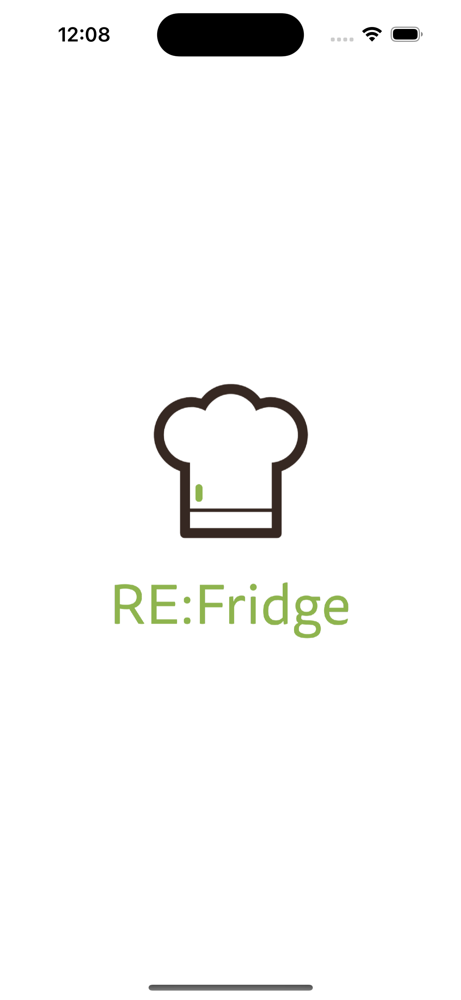
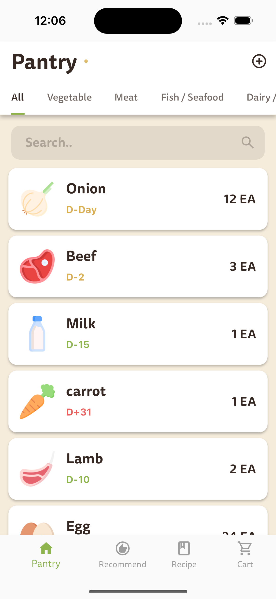
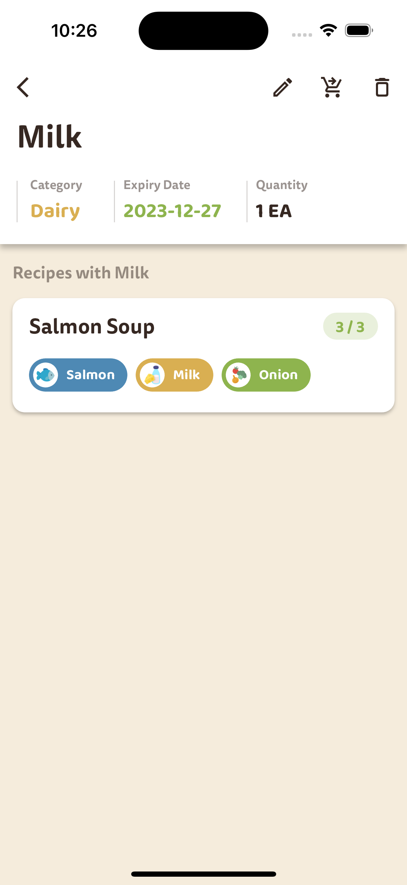
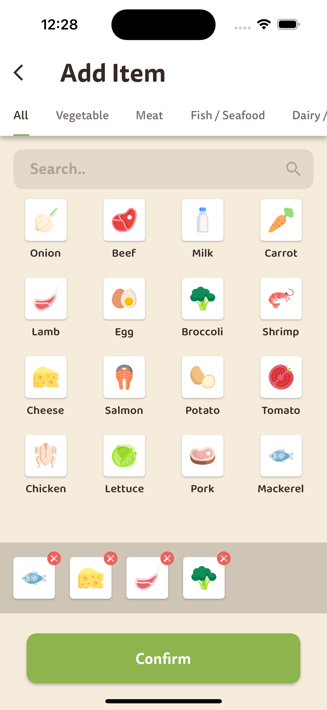
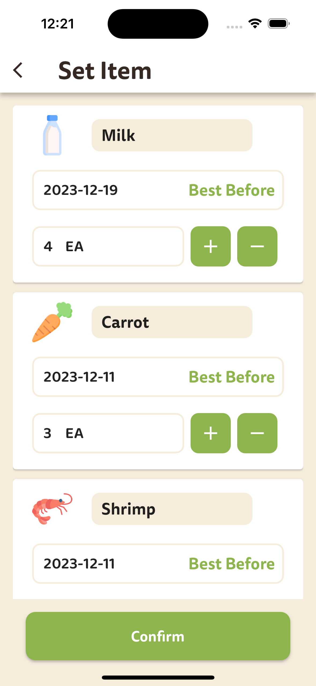
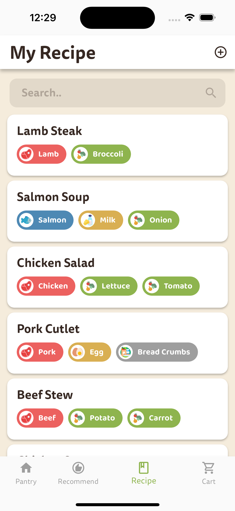
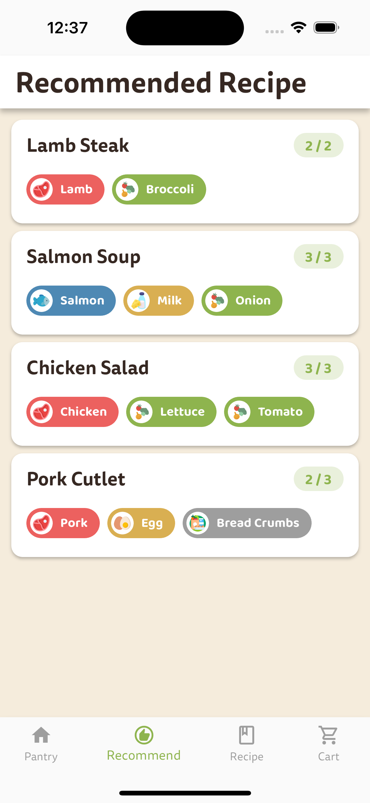
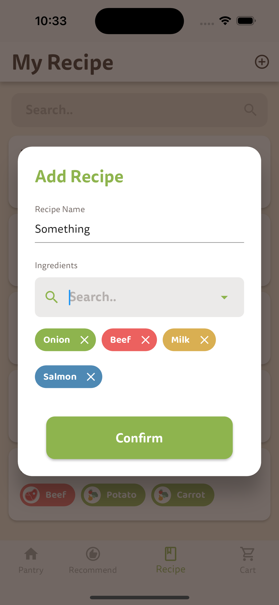
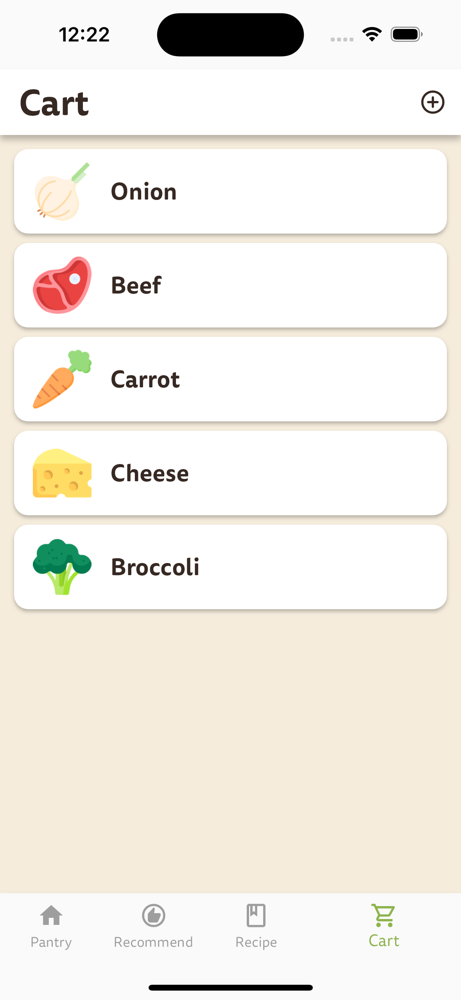

# RE-Fridge

Manage the expiration date of ingredients owned by users and recommend recipes using them to help manage ingredients more efficiently

# 🚀 Getting Started

### 1. Install Flutter

### 2. Clone the repository

```bash
git clone
```

### 3. Install dependencies

```bash
flutter pub get
```

### 4. Run the app

```bash
flutter run
```

# 📦 Dependencies

- [io](https://pub.dev/packages/io)
- [get](https://pub.dev/packages/get)
- [http](https://pub.dev/packages/http)
- [flutter_slidable](https://pub.dev/packages/flutter_slidable)
- [fluttertoast](https://pub.dev/packages/fluttertoast)
- [animated_bottom_navigation_bar](https://pub.dev/packages/animated_bottom_navigation_bar)
- [flutter_native_splash](https://pub.dev/packages/flutter_native_splash)

# 📷 Screenshots

### 1. Splash Screen



### 2. Pantry Screen

<p>




</p>

### 3. Recipe Screen

<p>



</p>

### 4. Cart Screen



# 📖 Contribution Guide

Thank you for contributing to the RE:Fridge! Please follow this contribution guide to help advance the project together.

## Before Contributing

- Check the open issues in the issue tracker to see if there are existing tasks or discussions.
- Consider what modifications or additions are needed, and start a discussion by creating an issue.

## How to Contribute

### 1. Fork this repository

### 2. Clone it to your local environment

```bash
git clone https://github.com/YunDo-Gi/RE-Fridge.git
```

### 3. Create a development branch

```bash
git checkout -b <branch-name>
```

### 4. Make changes and commit

```bash
git add .
git commit -m "<commit-message>"
```

### 5. Push changes

```bash
git push origin <branch-name>
```

### 6. Create a pull request

### 7. Wait for the pull request to be reviewed and merged

## Reporting Issues

# 🔧 Project Structure

```
RE-Fridge
├─📄 .gitignore
├─📄 analysis_options.yaml
├─📦 assets
│  ├─ 📂 fonts
│  │  ├─📄 Baloo2-Bold.ttf
│  │  ├─📄 Baloo2-ExtraBold.ttf
│  │  ├─📄 Baloo2-Medium.ttf
│  │  ├─📄 Baloo2-Regular.ttf
│  │  ├─📄 Baloo2-SemiBold.ttf
│  │  ├─📄 Tisa-Sans-Pro-Black.ttf
│  │  ├─📄 Tisa-Sans-Pro-Bold.ttf
│  │  ├─📄 Tisa-Sans-Pro-ExtraBold.ttf
│  │  ├─📄 Tisa-Sans-Pro-ExtraLight.ttf
│  │  ├─📄 Tisa-Sans-Pro-Light.ttf
│  │  ├─📄 Tisa-Sans-Pro-Medium.ttf
│  │  └─📄 Tisa-Sans-Pro-Regular.ttf
│  └─ 📂 images
│     └─📄 splash.png
├─📄 flutter_native_splash.yaml
├─📦 lib
│  ├─ colors.dart
│  ├─ 📂controllers
│  │  ├─📄 add_item_controller.dart
│  │  ├─📄 cart_controller.dart
│  │  ├─📄 navigation_bar_controller.dart
│  │  ├─📄 pantry_controller.dart
│  │  ├─📄 recipe_controller.dart
│  │  ├─📄 recommended_recipe_controller.dart
│  │  └─📄 tag_controller.dart
│  ├─📄 main.dart
│  ├─ 📂 models
│  │  ├─📄 cart_item.dart
│  │  ├─📄 category_data.dart
│  │  ├─📄 ingredient.dart
│  │  ├─📄 recipe.dart
│  │  └─📄 tag.dart
│  ├─ 📂 views
│  │  ├─📄 add_cart_item.dart
│  │  ├─📄 add_Item.dart
│  │  ├─📄 app.dart
│  │  ├─📄 cart.dart
│  │  ├─📄 my_recipe.dart
│  │  ├─📄 pantry.dart
│  │  ├─📄 pantry_item_detail.dart
│  │  ├─📄 recipe_detail.dart
│  │  ├─📄 recommended_recipe.dart
│  │  └─📄 set_item.dart
│  └─ 📂 widgets
│     ├─📄 added_ingredient_card.dart
│     ├─📄 add_recipe_dialog.dart
│     ├─📄 cart_card.dart
│     ├─📄 custom_divider.dart
│     ├─📄 ingredient_card.dart
│     ├─📄 navigation_bar_bottom.dart
│     ├─📄 pantry_item.dart
│     ├─📄 pantry_match_recipe_card.dart
│     ├─📄 recipe_card.dart
│     ├─📄 recommended_recipe_card.dart
│     ├─📄 tag_chip.dart
│     └─📄 tag_chip_fixed.dart
├─📄 pubspec.yaml
├─📄 README.md

```
